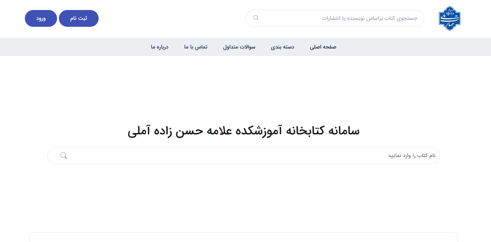
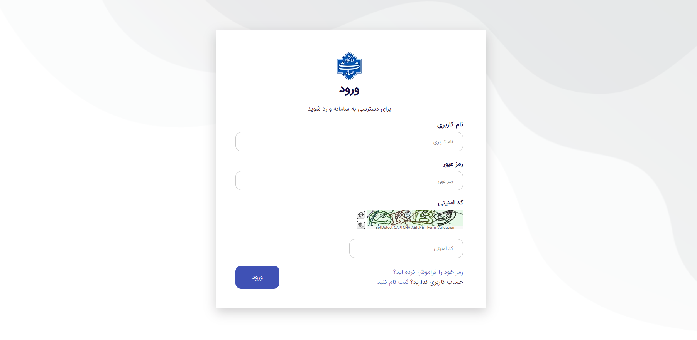

# University Library System

A web-based university library management system built with **ASP.NET Web Forms** and **Entity Framework Database First**.

The system is designed to help universities manage books, categories, users, students, reservations, and library-related operations through a centralized web application.

## 📌 Features

* 🔐 User authentication and registration
* 👨‍🎓 Student management
* 👨‍💼 Manager / administrator management
* 📚 Book management
* 🗂️ Book category management
* 🔎 Book search
* 📖 Book details
* 📌 Book reservation
* 👥 User management
* 🖼️ Web-based interface
* 🗄️ Database integration using Entity Framework

## 🛠️ Technologies

* **C#**
* **ASP.NET Web Forms**
* **.NET Framework**
* **Entity Framework**
* **SQL Server**
* **HTML5**
* **CSS3**
* **JavaScript**
* **Bootstrap / Front-end libraries**

## 🏗️ Project Structure

```text
UniversityLibrarySystem/
│
├── Classes/
├── Fakes/
├── Manager/
├── Student/
├── Properties/
├── PAPAssets/
│
├── css/
├── js/
├── img/
├── fonts/
├── content/
│
├── MainModel.cs
├── MainModel.Context.cs
├── MainModel.edmx
├── MainModel.tt
│
├── ULSTbl_Books.cs
├── ULSTbl_Categories.cs
├── ULSTbl_Reserve.cs
├── ULSTbl_Users.cs
│
├── Global.asax
├── Web.config
├── packages.config
└── UniversityLibrarySystem.csproj
```

## 🗄️ Database

The project uses **Entity Framework Database First**.

The Entity Data Model is defined in:

```text
MainModel.edmx
```

The generated entity and context classes are used to communicate with the SQL Server database.

### Main entities

* Users
* Books
* Categories
* Reservations
* Roles
* Membership-related entities

> The database connection settings are configured through `Web.config`.

## 🚀 Getting Started

### 1. Clone the repository

```bash
git clone https://github.com/HedayatiNiaDev/UniversityLibrarySystem.git
```

### 2. Open the solution

Open:

```text
UniversityLibrarySystem.sln
```

using **Visual Studio**.

### 3. Restore NuGet packages

Restore the required NuGet packages from Visual Studio.

### 4. Configure the database

Update the database connection string in:

```text
Web.config
```

Make sure SQL Server is available and the required database has been created.

### 5. Build the project

In Visual Studio:

```text
Build → Build Solution
```

### 6. Run the application

Start the project using:

```text
IIS Express
```

or the configured local web server.

## 🖥️ Screenshots

### Home

### Login

### Web Settings


## 🔒 Security Note

Do not commit production database credentials, passwords, API keys, or other sensitive configuration values to the repository.

For local development, configure sensitive values in your local environment or development configuration.

## 📚 Project Type

This project is based on:

```text
ASP.NET Web Forms
.NET Framework
Entity Framework Database First
SQL Server
```

It is **not an ASP.NET Core application**.

## 📄 License

This project is licensed under the terms specified in `LICENSE.txt`.

## 👨‍💻 Author

**HedayatiNiaDev**

GitHub: [HedayatiNiaDev/UniversityLibrarySystem](https://github.com/HedayatiNiaDev/UniversityLibrarySystem)

## ⭐ Support

If you find this project useful, consider giving the repository a ⭐ on GitHub.
