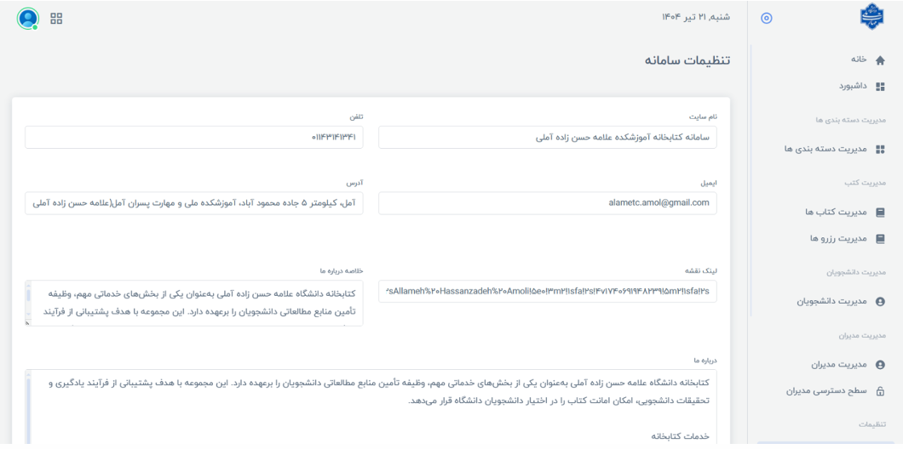

# 📚 سامانه مدیریت کتابخانه دانشگاه علامه حسن‌زاده آملی

## 📖 درباره پروژه

این پروژه یک **سامانه تحت وب برای مدیریت کتابخانه دانشگاهی** است که با هدف دیجیتالی‌سازی و ساده‌سازی فرآیندهای مدیریت کتابخانه طراحی و پیاده‌سازی شده است.

این سامانه امکاناتی مانند مدیریت کتاب‌ها، دسته‌بندی‌ها، کاربران، رزرو، امانت، تمدید، جریمه، گزارش‌گیری و مدیریت تنظیمات را در اختیار مدیران و دانشجویان قرار می‌دهد.

---

## ✨ امکانات اصلی

### 👨‍💼 پنل مدیریت

* مشاهده آمار کلی سامانه
* نمایش تعداد مدیران و دانشجویان
* نمایش تعداد کتاب‌ها
* نمایش کتاب‌های قابل رزرو
* نمایش کتاب‌های امانت داده شده
* نمایش کتاب‌های دارای جریمه
* بروزرسانی خودکار داشبورد بدون نیاز به Refresh
* مدیریت کاربران
* مدیریت مدیران و سطح دسترسی آن‌ها
* مدیریت کتاب‌ها
* مدیریت دسته‌بندی کتاب‌ها
* مدیریت رزروها
* مدیریت وضعیت امانت و جریمه‌ها
* گزارش‌گیری از فعالیت کاربران

### 👨‍🎓 امکانات دانشجویان

* مشاهده رزروهای فعال، لغوشده و در انتظار
* جستجو بین رزروها
* مشاهده وضعیت امانت کتاب‌ها
* مشاهده وضعیت جریمه‌ها
* مدیریت حساب کاربری
* مشاهده گزارش ورودهای اخیر
* خروج از سایر دستگاه‌های فعال

---

## 📚 مدیریت کتاب‌ها

امکانات بخش مدیریت کتاب شامل موارد زیر است:

* افزودن کتاب
* ویرایش اطلاعات کتاب
* حذف کتاب
* جستجو بر اساس عنوان
* جستجو بر اساس ISBN
* دسته‌بندی کتاب‌ها
* مدیریت وضعیت کتاب
* مدیریت تعداد و موجودی کتاب‌ها

---

## 🔖 سیستم رزرو و امانت

سامانه امکان مدیریت کامل فرآیند رزرو و امانت کتاب را فراهم می‌کند.

### امکانات

* رزرو کتاب
* مدیریت وضعیت رزرو
* لغو رزرو
* مشاهده تاریخ شروع و پایان رزرو
* ثبت اطلاعات امانت
* تمدید کتاب
* کنترل تاریخ بازگرداندن کتاب
* ثبت خودکار جریمه در صورت تأخیر

---

## 🤖 قابلیت‌های هوشمند

برخی از فرآیندهای سامانه به صورت خودکار انجام می‌شوند:

### بررسی خودکار رزروها

سامانه هر ۲۴ ساعت رزروهای موقت را بررسی می‌کند و در صورتی که زمان رزرو به پایان رسیده باشد، رزرو به صورت خودکار حذف می‌شود.

### کنترل وضعیت امانت‌ها

سیستم به صورت روزانه وضعیت امانت کتاب‌ها را بررسی می‌کند.

در صورتی که تاریخ بازگرداندن کتاب گذشته باشد:

* وضعیت امانت به حالت جریمه تغییر می‌کند.
* جریمه برای کاربر ثبت می‌شود.

### مدیریت نشست‌ها

کاربران می‌توانند از تمام نشست‌های فعال خود، به جز نشست فعلی، خارج شوند.

---

## 🔐 امنیت

برای مدیریت کاربران و امنیت سامانه از امکانات زیر استفاده شده است:

* ASP.NET Membership
* احراز هویت کاربران
* ورود و خروج امن
* مدیریت نقش‌ها
* سطح‌بندی دسترسی
* محدودسازی دسترسی به صفحات مدیریتی
* ذخیره رمزهای عبور به صورت Hash
* ثبت تاریخچه ورود و خروج کاربران
* مدیریت نشست‌های فعال
* پشتیبانی از HTTPS در نسخه عملیاتی

---

## ⚙️ تنظیمات سامانه

مدیر اصلی سیستم می‌تواند تنظیمات مختلف کتابخانه را مدیریت کند.

### تنظیمات عمومی

* نام سایت
* شماره تلفن
* آدرس
* ایمیل
* موقعیت روی نقشه
* متن درباره ما

### قوانین و محدودیت‌ها

* تعداد روز مجاز برای امانت کتاب
* حداکثر تعداد کتاب قابل امانت
* تعداد دفعات تمدید مجاز
* مبلغ جریمه تأخیر

### وضعیت سامانه

* باز یا بسته بودن سایت
* فعال یا غیرفعال بودن رزرو موقت

---

## 🛠️ تکنولوژی‌های استفاده‌شده

### Backend

* ASP.NET
* ASP.NET Web Forms / MVC
* C#

### Database

* Microsoft SQL Server

### ORM

* Entity Framework
* LINQ
* Code First

### Authentication & Security

* ASP.NET Membership

### Frontend

* HTML
* CSS
* JavaScript
* Bootstrap
* Ajax

### Development Tools

* Visual Studio
* SQL Server Management Studio (SSMS)

---

## 🗄️ ساختار پایگاه داده

### جدول `Books`

اطلاعات کتاب‌ها در این جدول ذخیره می‌شود.

برخی از فیلدهای اصلی:

```text
ID
BookTitle
AuthorName
TranslatorName
PublisherName
ISBN
CategoryId
Status
IsSpecial
Available
Count
UserNameAdder
```

### جدول `Categories`

برای مدیریت دسته‌بندی کتاب‌ها استفاده می‌شود.

```text
ID
Title
PicName
Status
DateInsert
UserNameAdder
```

### جدول `Reservations`

اطلاعات رزرو و امانت کتاب‌ها در این بخش نگهداری می‌شود.

```text
ID
UserName
BookID
CustomCode
ReserveStartDate
ReserveEndDate
DeliveryDate
StatusID
Renewal
```

---

## 🔗 روابط اصلی پایگاه داده

```text
Categories
    │
    │ 1
    ▼
Books
    │
    │ 1
    ▼
Reservations
    │
    └── UserName ──► Users
```

* هر کتاب به یک دسته‌بندی متصل است.
* هر رزرو مربوط به یک کتاب است.
* هر رزرو متعلق به یک کاربر است.

---

## 📊 داشبورد مدیریتی

داشبورد سامانه اطلاعات مهم را به صورت لحظه‌ای نمایش می‌دهد:

* تعداد مدیران
* تعداد دانشجویان
* تعداد حساب‌های غیرفعال
* تعداد کل کتاب‌ها
* تعداد کتاب‌های قابل رزرو
* تعداد کتاب‌های امانت داده شده
* تعداد کتاب‌های دارای جریمه

اطلاعات داشبورد به صورت خودکار و بدون نیاز به Refresh بروزرسانی می‌شوند.

---

## 🚀 توسعه‌های آینده

این پروژه با ساختاری قابل توسعه طراحی شده است و در آینده می‌توان امکانات زیر را به آن اضافه کرد:

* 📱 سامانه پیامکی
* 🔔 سیستم Notification
* 📲 اپلیکیشن موبایل
* 📈 گزارش‌های پیشرفته‌تر
* 📧 سیستم اطلاع‌رسانی ایمیلی
* 🤖 توسعه قابلیت‌های هوشمند سامانه

---

## 🎯 هدف پروژه

هدف اصلی پروژه، ایجاد یک سیستم یکپارچه برای مدیریت فرآیندهای کتابخانه دانشگاهی و کاهش مشکلات سیستم‌های سنتی است.

از مهم‌ترین اهداف پروژه می‌توان به موارد زیر اشاره کرد:

* دیجیتالی‌سازی فرآیند رزرو و امانت
* کاهش خطاهای انسانی
* مدیریت یکپارچه کتابخانه
* افزایش امنیت کاربران
* مدیریت کامل تنظیمات
* ارائه آمار و گزارش‌های مدیریتی
* ایجاد ساختاری قابل توسعه برای آینده

---

## 📸 تصاویر پروژه





---

## 👨‍💻 توسعه‌دهنده

**امیر محمد هدایتی نیا**

---

## 📄 License

این پروژه برای اهداف آموزشی و دانشگاهی توسعه داده شده است.

---

⭐ اگر این پروژه برای شما مفید بود، خوشحال می‌شوم از آن حمایت کنید.
